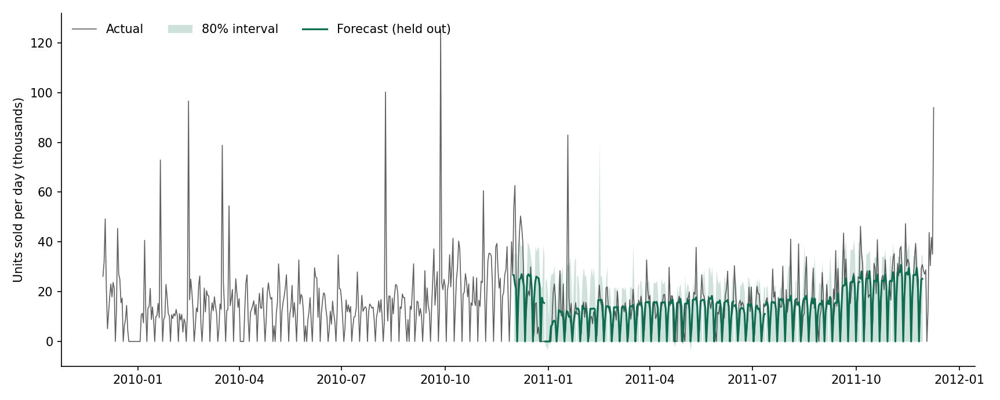
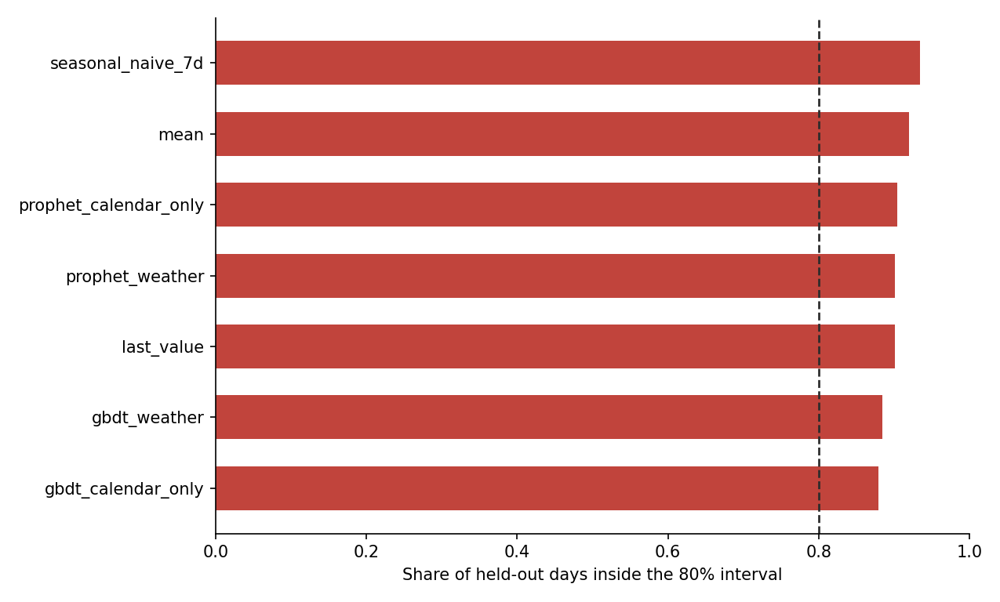
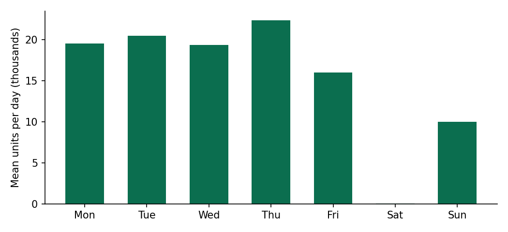

# DemandSense

Daily demand forecasting on a real retailer's transaction log, built to answer one
question honestly: does knowing tomorrow's weather help you predict tomorrow's
orders?

For this retailer, no. That is the result, and this README is organised around it.



Two openly licensed sources, both committed or fetchable by a script, so anyone
cloning this repository reproduces every number below:

* **UCI Online Retail II** (CC BY 4.0): 1,067,371 transactions of a UK online gift
  retailer, 2009-12-01 to 2011-12-09.
* **Open-Meteo historical reanalysis** (CC BY 4.0): daily London temperature and
  rainfall over the same span.

---

## The weather hypothesis does not survive

An earlier version of this project generated its own sales data with a weather
term written into the generator, then reported that the model detected a weather
effect. That is circular. This version asks the question of real data.

Two model families, each fitted twice on identical cross-validation folds, once
with temperature and rainfall as regressors and once without:

| Comparison | MAE reduction from adding weather | 95% CI | Folds won |
|---|---|---|---|
| Prophet | **+2** | `[-81, +84]` | 6 of 13 |
| Gradient boosting | **+309** | `[-278, +895]` | 5 of 13 |

Both intervals straddle zero. The weather model wins fewer than half the folds in
one case and barely half in the other. Prophet's entire benefit from knowing the
weather is 2 units of MAE on a base of 5,982, which is 0.03%.

The raw correlation agrees: daily temperature against units sold is `-0.032`
across all days, or `-0.084` if the non-trading days are excluded. People ordering
novelty gifts by post do not check the forecast first.

The temperature slider in the app still moves the forecast, because the regressor
is in the model. The backtest is what says whether the movement means anything,
and it says no.

## What does hold up

| | MAE | MAPE | 80% coverage |
|---|---|---|---|
| **Gradient boosting + weather** | **4,917** | **37.7%** | 0.885 |
| Gradient boosting, calendar only | 5,226 | 39.0% | 0.879 |
| Prophet + weather | 5,982 | 41.2% | 0.901 |
| Prophet, calendar only | 5,983 | 41.9% | 0.904 |
| Seasonal naive, lag 7 | 6,479 | 49.6% | 0.934 |
| Historical mean | 8,920 | 53.0% | 0.920 |
| Last value | 10,226 | 72.0% | 0.901 |

Read down the column and two things stand out.

**Gradient boosting beats the naive baseline, and that is established.** Paired
across folds: 1,562 MAE better than seasonal naive, 95% CI `[+690, +2,434]`,
winning 11 of 13 folds.

**Prophet does not.** Against the same baseline, Prophet is 498 MAE better with a
95% CI of `[-525, +1,521]`, winning 6 of 13 folds. The library this project was
originally built around cannot be distinguished from predicting last Tuesday's
number for next Tuesday. Head to head, gradient boosting beats Prophet by 1,064
MAE, CI `[+230, +1,899]`, 11 of 13 folds.

That is not a knock on Prophet in general. It is a two-year daily series with one
strong weekly cycle and a structural zero, and a boosted tree on calendar features
handles that shape better than an additive decomposition does.

## Why the comparisons are paired

Fold difficulty varies enormously here. The hardest fold costs the winning model
12,675 MAE and the easiest 2,308, a factor of five, because December is December.
Comparing two averaged MAEs throws away the fact that every engine saw identical
folds, and the fold-to-fold spread then swamps the difference between methods.

Differencing within each fold removes the shared difficulty. It changes
conclusions: on the unpaired view the gradient boosting lead over the baseline
looks like noise, and it is not.

`paired_comparison()` in `src/demandsense/model.py` does this, and one of its tests
exists specifically to show that a consistent 400-unit edge stays detectable when
the fold spread is four times larger.

## The intervals are too wide, not too narrow



Every method's 80% interval contains more than 80% of held-out days, from 0.879 to
0.934. That is the safer direction to be wrong in, and it is still wrong: an
interval that claims 80% and delivers 93% is not calibrated, and the inventory
range built on it is wider than it needs to be.

Reported rather than quietly dropped, because an interval nobody checks is
decoration.

## The data has one large quirk, and it is kept



This retailer does not invoice on Saturdays. Of 105 Saturdays in the series,
exactly **1** has any sales at all, and the Saturday mean is 49 units against
roughly 20,000 on a weekday. Sunday trades at about half a weekday.

Those days are kept as zeros on a complete daily grid rather than dropped. A model
that never sees them cannot learn the weekly shape, and `check_spacing` refuses to
run on a grid with a hole in it. 135 of 739 days are zeros, 18.3% of the series.

| Mon | Tue | Wed | Thu | Fri | Sat | Sun |
|---|---|---|---|---|---|---|
| 19,562 | 20,463 | 19,353 | 22,397 | 16,003 | **49** | 10,026 |

## Cleaning, with the counts

Four exclusions, each with a reason, each counted into `reports/metrics.json`:

| Removed | Rows | Why |
|---|---|---|
| Credit notes | 19,494 | Returns are a separate process from demand. Netting them off would let a March refund cancel a December sale. |
| Non-product codes | 4,589 | `POST`, `BANK CHARGES`, `AMAZONFEE`, `ADJUST` and similar move with billing, not demand. |
| Non-positive quantities | 3,457 | The same thing recorded differently. |
| No price | 2,750 | Not a completed sale. |

1,067,371 rows in, **1,037,081** kept. A test asserts the five counts sum exactly
to the raw total, so the arithmetic in this table has to hold.

## The inventory decision keeps the uncertainty

A forecast is a distribution, so the stockout date is a range. The app runs the
cumulative demand three times, on the lower, median and upper paths. Faster demand
empties the shelf sooner, so the upper bound gives the earliest stockout, and the
reorder date is computed from that rather than from the median. Planning against
the expected date leaves you short half the time.

The app reports units of demand beyond available stock as an upper bound on lost
sales, not an estimate. It assumes every customer who cannot buy is gone, when in
practice some wait and some substitute, and nothing here measures how many.

## What I would not claim

- **No causal claim about weather, in either direction.** The null result says
  temperature and rainfall do not improve a forecast of this retailer's daily
  units. It does not say weather never matters in retail, and a garden centre
  would give a different answer.
- **One retailer, two years, one weather station.** London stands in for a
  customer base that is mostly but not entirely UK. That is an approximation.
- **No retention or revenue lift is demonstrated.** The app produces a reorder
  date. Nobody has ordered anything on its say-so, and nothing here measures
  whether following it would help.
- **The intervals are miscalibrated**, as shown above, so the stockout range is
  wider than the model's nominal 80% implies.
- **These numbers move slightly between environments.** Gradient boosting is not
  bit-identical across scikit-learn builds. Two runs of this repository differed
  in the third significant figure on MAE. `scripts/verify_readme.py` re-derives
  every figure quoted here from `reports/`, so a rerun that moves a number fails
  loudly instead of quietly leaving the prose wrong.

## How it works

**The app loads the model, it does not train it.** A Streamlit app that refits on
page load cannot be the model whose backtest is published, because the two drift
apart silently. `scripts/train.py` writes `models/forecaster.joblib` and
`reports/metrics.json`, and `app.py` reads both.

**The evaluation is time-ordered.** Rolling origin, expanding window, 365-day
initial training window, 28-day horizon, 28-day step, 13 folds. No training row is
ever dated after the rows it is scored on, and a test asserts exactly that. There
is no in-sample error anywhere in this repository; a separate test demonstrates
why, by showing that scoring a model on its own training rows reports an error
more than 1.5 times optimistic.

**Leakage is blocked by name, not by care.** `LEAKY_COLUMNS` maps the target and
its aliases to the reason each is barred, and `design_matrix` raises if any
reaches the feature set.

## Running it

```bash
pip install -r requirements.txt

# 1. Put online_retail_II.xlsx in data/
#    https://archive.ics.uci.edu/dataset/502/online+retail+ii
python scripts/fetch_weather.py     # daily London weather, no API key needed
python scripts/train.py             # ~2 min: backtests 7 methods, writes reports/
python scripts/verify_readme.py     # re-derives every figure quoted above
python -m unittest discover -s tests   # 46 tests, no data needed
streamlit run app.py
```

```
src/demandsense/
  data.py       loading, cleaning with a counted audit, the leakage blocklist
  model.py      engines, baselines, rolling-origin CV, paired comparison
  inventory.py  stockout window and reorder date, carrying the interval through
scripts/
  fetch_weather.py  Open-Meteo daily weather for the span of the sales data
  train.py          backtests every method, writes reports/ and models/
  verify_readme.py  checks every number in this README against reports/
app.py          Streamlit front end: forecast, scenario, inventory decision
tests/          46 tests: leakage, cleaning arithmetic, fold ordering, pairing
reports/        metrics.json, folds.csv, figures
```

## Data and attribution

Transactions: UCI Online Retail II, CC BY 4.0.
Weather: Open-Meteo historical reanalysis, CC BY 4.0.

`data/online_retail_II.xlsx` is 45 MB and is not committed; the link above is the
source. `data/weather_london.csv` is small and openly licensed, so it is committed
and the repository is reproducible after one download.

## License

MIT
